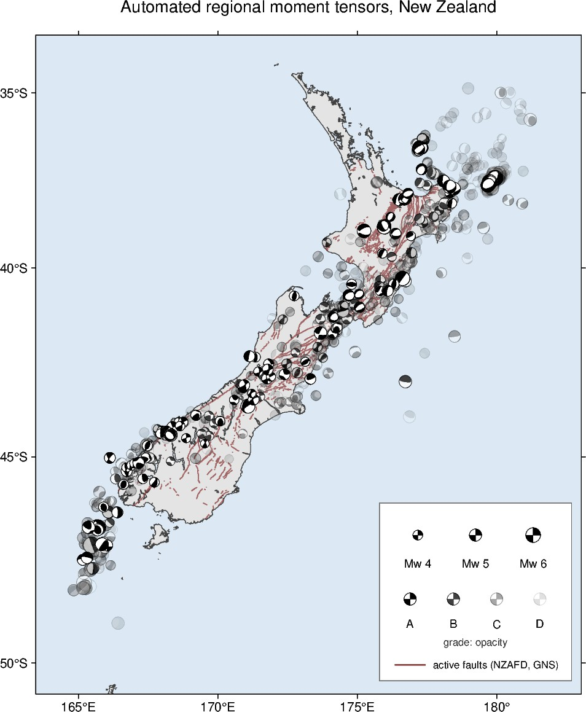

# auto_tdmt_NZ

**A personal tool for rapid InSAR response.** When a New Zealand earthquake
happens, the question I need answered within minutes is: *has this event
likely produced measurable surface displacement, and do I need to act as an
InSAR scientist* (task acquisitions, prepare processing, look at the next
NISAR/Sentinel-1 pass)? Answering that requires a moment tensor, so this
pipeline watches the GeoNet quake feed, runs a Dreger-style time-domain
moment tensor inversion ([LLNL mttime](https://github.com/LLNL/mttime))
with CPS Green's functions and the Ristau (2008) NZ velocity models,
forward-models the predicted surface displacement for both nodal planes
(Okada), reports NISAR acquisition timing over the epicentre, and emails
the result to a small list. The moment tensor solutions are a useful
by-product for other scientists; the displacement field is the point.

Event detection and every original hypocentre (time, location, preliminary
magnitude, initial depth) come from GeoNet; this project adds the moment
tensor, the revised centroid depth, and the displacement forecast on top
of that origin, and records both the GeoNet values and the revisions in
[`events/catalogue.csv`](events/catalogue.csv).

This is a personal, external project by Danielle Lindsay, not an
operational product of any agency, and it makes no representation about
any organisation's internal systems.

**All solutions are PRELIMINARY, deviatoric-only, and produced without
human review** — do not interpret mechanisms in volcanic/geothermal
settings from these solutions.

<p align="center"></p>

## How it works

```
GeoNet quake API (poll, 10 min cron)
  -> processing floor (prelim M >= 4.0, NZ bbox)          run01_watch.py
  -> waveforms: GeoNet NRT FDSN, NZ broadbands <= 400 km   waveforms.py
     response removal -> ZRT -> bandpass -> 1 sps SAC
  -> Green's functions: precomputed CPS library            greens.py
     (Ristau 2008 North/South Island models, 10-500 km,
      depths 2-58 km, 10 Herrmann fundamental sources)
  -> mttime deviatoric inversion, depth search,            invert.py
     BSL-style filter-band menu, low-VR station rejection,
     preferred pick = max %DC within 5 VR points of max
  -> quality gates (stations, VR, azimuthal gap, depth)    invert.py
  -> Okada forward model (both nodal planes,               okada_forward.py
     Wells & Coppersmith dimensions) -> predicted peak
     surface displacement
  -> NISAR last/next pass at epicentre (CMR)               nisar_dates.py
  -> figures (matplotlib/cartopy + mttime fits)            figure.py
  -> publication gates (our Mw >= 5.0 OR predicted         trigger.py
     displacement >= 1 cm; aftershock throttle; daily cap)
  -> email to the list (SMTP secrets)                      publish.py
```

Solutions, figures, and provenance are committed to `events/` — the repo is
the public archive — and [`events/catalogue.csv`](events/catalogue.csv) (column reference:
[`events/CATALOGUE_README.md`](events/CATALOGUE_README.md)) is
regenerated from the archived solutions after every event: one row per
solution with origin, nodal planes, Mw/Mo, centroid depth, %DC/%CLVD, VR and
MT elements (1e20 dyne-cm, matching the GeoNet CMT catalogue conventions). Every `solution.json` records the velocity model, GF
version, package versions, stations used/dropped (with reasons), the full
depth-search table and the band search.

## Local setup (macOS / Linux)

```sh
pixi install
pixi run test
# one-time Green's function library build (needs CPS):
#   brew install gcc && download+build CPS NP330 (see docs), then
pixi run python greens.py --build
# process one event:
pixi run python run02_process.py --event 2026p660242 --debug
```

`--debug` writes stage-by-stage troubleshooting figures (raw counts,
displacement, filtered ZRT record sections, station map) under
`<event>/<band>/diagnostics/`.

Outputs default to `~/work/proj_tdmt_NZ`; override with `AUTO_TDMT_OUTPUT`,
`AUTO_TDMT_EVENTS`, `AUTO_TDMT_GF` (CI points these into the checkout).

## CI (GitHub Actions)

- `watch.yml` — cron every 10 min: poll, process new events, email passing
  solutions, commit results.
- `process.yml` — manual reprocess of one publicID (with optional debug).
- `publish.yml` — manual email of one processed event (`force` to override
  gates).

The GF libraries are attached to the `gf-latest` release as
`gf_library.tar.zst` (containing `gf_cache/<model>/v1/...`) and cached in CI;
CPS never runs in CI. Rebuild + re-upload after any velocity model change:

```sh
pixi run python greens.py --build
cd ~/work/proj_tdmt_NZ && cp -r gf_library gf_cache \
  && tar --zstd -cf gf_library.tar.zst gf_cache && rm -r gf_cache
gh release create gf-latest gf_library.tar.zst --notes "GF libraries"
```

Secrets required for email: `SMTP_HOST`, `SMTP_PORT`, `SMTP_USER`,
`SMTP_PASS`, `MAIL_FROM`, `MAIL_TO` (ideally a single Google Group address so
subscriber addresses never live in this public repo).

## Velocity models

`models/nz_{north,south}_ristau2008.d` — Ristau (2008), SRL 79(3) Table 1,
doi:10.1785/gssrl.79.3.400 — so solutions are directly comparable to the
published NZ regional CMT solutions
([GeoNet/data moment-tensor](https://github.com/GeoNet/data/tree/main/moment-tensor);
their MT elements are in 1e20 dyne-cm).

## Operating thresholds

| Stage | Rule |
|---|---|
| **Triggers** | GeoNet preliminary magnitude >= 4.0, inside the NZ box (33-50.5 S, 164 E-177.5 W), event type "earthquake", depth <= 30 km (GeoNet fixed placeholder depths 5/12/33 km are exempt: true depth unknown, the depth search decides) |
| **Station selection** | NZ broadbands (HH? preferred over BH?), 20-400 km; SNR >= 2.0 in the inversion band, topped up to SNR >= 1.2 when fewer than 5 stations pass; stations with individual VR < 10% rejected after a first pass |
| **Depth search** | 1-5 km at 0.5 km, to 10 km at 1 km, to 30 km at 2 km, to 58 km at 4 km; full grid for placeholder depths, else +/-20 km of the GeoNet depth |
| **Rated** | A: VR >= 70, >= 5 stations, azimuthal gap <= 180. B: VR >= 60, >= 3 stations, gap <= 270. C: VR >= 50, >= 2 stations. D: below |
| **Publishes** | grade A or B AND (our Mw >= 5.0 OR Okada-predicted peak displacement >= 1 cm); max 3 emails/day; aftershock throttle (within 75 km/14 d of a published event, must be within 0.5 Mw of it or above the Mw gate) |
| **Preferred solution** | highest %DC on the contiguous depth plateau within 5 VR points of the VR maximum; per-band, then across the magnitude-dependent band menu |

## Data sources

- GeoNet (Earth Sciences New Zealand) quake API + FDSN (NRT + archive):
  event detection, all original hypocentres, waveforms and station
  metadata. CC BY 3.0 NZ. Polling is polite: one request per 10-minute
  cron tick, gzip, descriptive User-Agent.
- NASA CMR for NISAR GSLC granule timing.
- NZ Active Faults Database (GNS Science) and GeoNet delta GNSS marks for
  map context.

## References

Software:

- Chiang, A. — **MTtime**, Time Domain Moment Tensor Inversion in Python,
  LLNL-CODE-814839, https://github.com/LLNL/mttime. Methodology after
  Dreger & Helmberger (1993), Dreger (2003) and Minson & Dreger (2008).
- Herrmann, R. B. (2013). Computer Programs in Seismology: an evolving
  tool for instruction and research. *Seism. Res. Lett.* 84, 1081-1088.
  https://rbherrmann.github.io/ComputerProgramsSeismology/
- Beyreuther, M., R. Barsch, L. Krischer, T. Megies, Y. Behr &
  J. Wassermann (2010). ObsPy: a Python toolbox for seismology.
  *Seism. Res. Lett.* 81(3), 530-533. https://github.com/obspy/obspy
- Jolivet, R. — **okada4py**, Python/C implementation of Okada (1992),
  https://github.com/jolivetr/okada4py
- Crameri, F. — Scientific colour maps,
  https://www.fabiocrameri.ch/colourmaps/ (via cmcrameri).

Method:

- Dreger, D. S., & D. V. Helmberger (1993). Determination of source
  parameters at regional distances with three-component sparse network
  data. *J. Geophys. Res.* 98, 8107-8125.
- Dreger, D. S. (2003). TDMT_INV: Time Domain Seismic Moment Tensor
  INVersion. *International Handbook of Earthquake and Engineering
  Seismology* 81B, 1627.
- Minson, S. E., & D. S. Dreger (2008). Stable inversions for complete
  moment tensors. *Geophys. J. Int.* 174, 585-592.
- Ristau, J. (2008). Implementation of routine regional moment tensor
  analysis in New Zealand. *Seism. Res. Lett.* 79(3), 400-415.
  doi:10.1785/gssrl.79.3.400 (velocity models, Table 1).
- Okada, Y. (1985). Surface deformation due to shear and tensile faults
  in a half-space. *Bull. Seism. Soc. Am.* 75(4), 1135-1154.
- Okada, Y. (1992). Internal deformation due to shear and tensile faults
  in a half-space. *Bull. Seism. Soc. Am.* 82(2), 1018-1040.
- Wells, D. L., & K. J. Coppersmith (1994). New empirical relationships
  among magnitude, rupture length, rupture width, rupture area, and
  surface displacement. *Bull. Seism. Soc. Am.* 84(4), 974-1002.
- Aki, K., & P. G. Richards (1980). *Quantitative Seismology*. W.H.
  Freeman (double-couple tensor construction used in validation).

This workflow was compiled with Claude (Anthropic) assistance under the
direction of Danielle Lindsay; the science stands on the shoulders of the
authors above — cite them, not this repository, for the methods.
