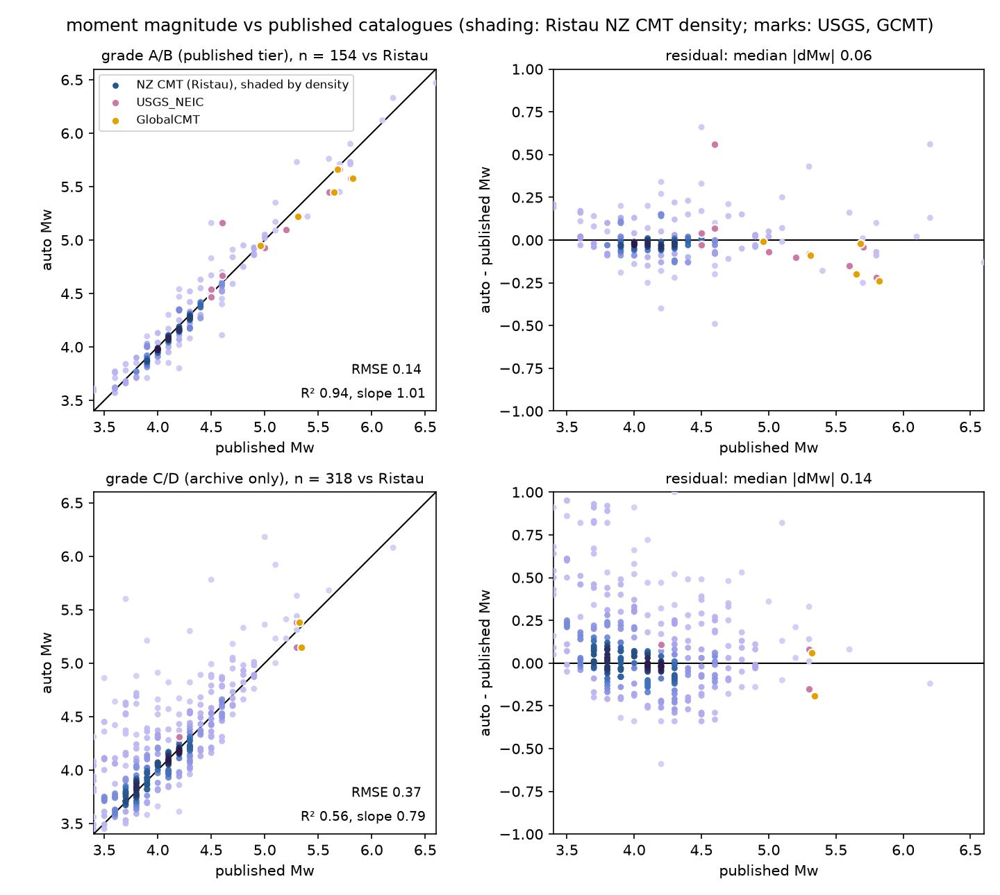
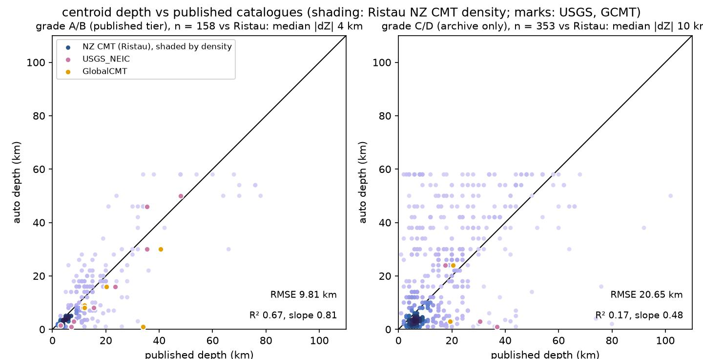
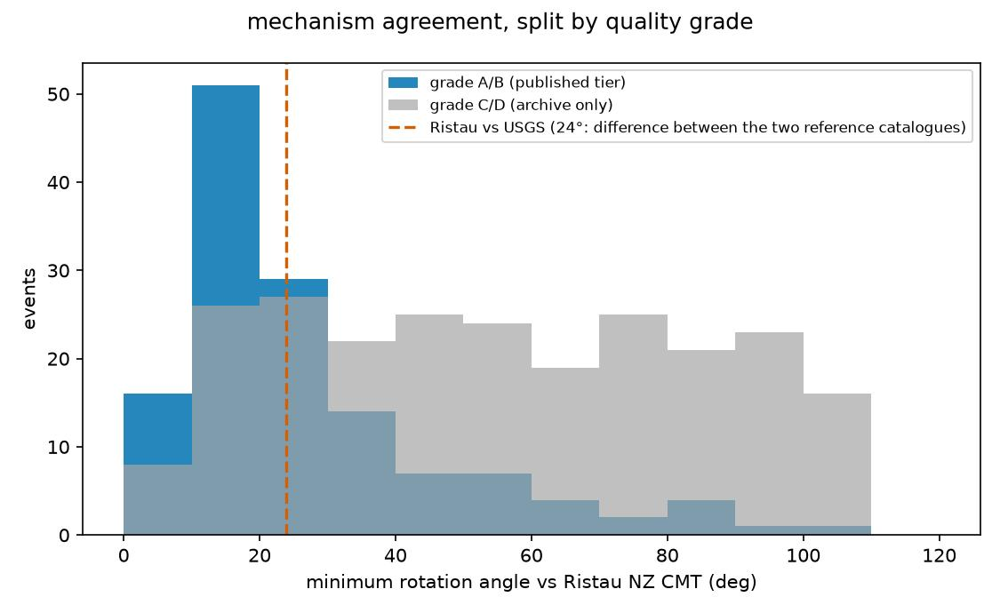

# Validation — how this catalogue is checked, and how it stacks up

Every solution in [`events/catalogue.csv`](../events/catalogue.csv) is
produced fully automatically and **independently** of any reference
catalogue (the depth search always covers the full Green's-function
grid; GeoNet's depth is recorded for comparison only). This directory
holds the standing comparison against three independent reference
catalogues, regenerated by:

```sh
pixi run python run05_validate.py
```

> **STATUS (2026-09-05): the numbers on this page describe station
> selection v3.** Selection v4 — the "funnel" that replaced the
> pre-inversion filters, plus evidence-based grades, the grid-edge depth
> guard, the depth plausibility check and the "no coherent solution"
> outcome (see [`docs/METHOD.md`](../docs/METHOD.md) §3.1 and the
> [README grade rubric](../README.md#quality-grades--how-a-solution-is-rated))
> — is implemented, unit-tested and shipped, but **has not yet been
> measured against these reference catalogues**. Nor has it been scored
> against the reviewer's own per-station labels
> ([`docs/review_labels/`](../docs/review_labels/)). Until that
> measurement is run and this page is regenerated, treat every number
> below as describing the previous version of the pipeline, and treat
> v4's improvements as *claims*, not results. The one v4 datum so far:
> on the 14 hand-labelled events, its solved-versus-abort verdict
> matched the reviewer's on 10.

Outputs: `comparison.csv` (one row per matched event–reference pair),
`comparison_mw.jpg`, `comparison_depth.jpg`, `comparison_rotation.jpg` (one figure per metric, embedded below), `validation_report.txt` (console
log). Numbers quoted below are from the 2026 catalogue as of
2026-09-04 (61 automated solutions).

## 1. Reference catalogues, and what each one tests

| Reference | What it is | What agreement tests |
|---|---|---|
| **NZ regional CMTs** (Ristau 2008 method; [GeoNet/data moment-tensor](https://github.com/GeoNet/data/tree/main/moment-tensor)) | Analyst-reviewed regional MT solutions using the same method family and the same published velocity models as this pipeline | The *automation*: with method and models shared, disagreement isolates what the automated station selection, band choice and depth search do differently from an expert analyst. The largest sample (n = 39 matches) and the primary benchmark. |
| **USGS NEIC** moment tensors (ComCat) | Independent agency, independent methods (regional W-phase / body-wave MT), independent software | *Method independence*: agreement here cannot be inherited from shared models or shared habits. Smaller sample (n = 10), larger events only. |
| **Global CMT** (Ekström et al. 2012) | The global long-period standard | The *moment scale and mechanism at long period* for the largest events (n = 6). GCMT centroid depths for shallow events are weakly constrained, so depth disagreement here is expected and uninformative below ~15 km. |

Three quantities are compared per matched event: moment magnitude,
centroid depth, and mechanism orientation.

## 2. Magnitude: ΔMw

$$\Delta M_w = M_w^{\mathrm{ours}} - M_w^{\mathrm{ref}}$$

**What it tells us**: whether the moment scale is calibrated — the
amplitude chain (instrument response → displacement → Green's-function
scaling) and, at small magnitudes, whether the inversion is fitting
signal or noise (noise fitting *inflates* moment, so a positive bias
that grows toward small magnitudes is the signature of noise
contamination, not calibration error).



**Current standing (vs Ristau)**: mean ΔMw **+0.04**, median |ΔMw|
**0.11** (n = 39); A/B grades alone: mean **−0.02**, median |ΔMw|
**0.07**. By reference-magnitude bin: +0.17 (Mw 3.5–4.0), +0.06
(4.0–4.5), −0.07 (≥ 4.5). The small-magnitude residual is carried
almost entirely by three grade-D solutions whose depth search ran to
the grid edge (a known artifact, see
[`docs/REVIEW_LEARNINGS.md`](../docs/REVIEW_LEARNINGS.md)); excluding
them the 3.5–4.0 bin sits at ≈ +0.02. Verdict: the published (A/B)
moment scale is unbiased at the 0.05 level.

## 3. Depth: ΔZ

$$\Delta Z = Z^{\mathrm{ours}} - Z^{\mathrm{ref}}$$

**What it tells us**: whether the waveform-based centroid depth search
— the quantity this pipeline revises most aggressively relative to
initial hypocentres — lands where independent estimates land. Depth
trades off against mechanism and %DC in long-period inversions, so
systematic depth bias would contaminate everything downstream
(including the Okada displacement forecast, which is the pipeline's
purpose).



**Current standing (vs Ristau)**: median |ΔZ| **4.0 km** overall;
**1.0 km** for A/B grades. Verdict: when the quality gates pass, the
independent depth search reproduces analyst depths at the kilometre
level — without ever being told them.

## 4. Mechanism: minimum rotation angle

Recommended by J. Townend (pers. comm., 2026-08-20), following
Townend et al. (2012, supplement eq. 1;
[`docs/Townend_etal_2012_supplement.pdf`](../docs/Townend_etal_2012_supplement.pdf))
and Walsh, Arnold & Townend (2009, eqs 1–3); cf. Kagan (1991).

Each double couple is represented as a rotation matrix
$\mathbf{R} = [\hat{\mathbf{t}}\ \hat{\mathbf{p}}\ \hat{\mathbf{b}}]$
whose columns are its principal axes in geographic (NED) coordinates,
built from the Aki & Richards (1980) slip vector $\hat{\mathbf{u}}$
and fault normal $\hat{\mathbf{n}}$:

$$\hat{\mathbf{t}} = \frac{\hat{\mathbf{u}}+\hat{\mathbf{n}}}{\sqrt{2}}, \qquad \hat{\mathbf{p}} = \frac{\hat{\mathbf{u}}-\hat{\mathbf{n}}}{\sqrt{2}}, \qquad \hat{\mathbf{b}} = \hat{\mathbf{t}} \times \hat{\mathbf{p}}$$

The angle between two mechanisms is

$$a = \cos^{-1} \left( \frac{ \mathrm{tr}(\mathbf{R}_1^{\top} \mathbf{R}_2 \mathbf{S}) - 1 }{2} \right)$$

$$\mathbf{S} \in \{ \mathbf{I}, \; \mathrm{diag}(1,-1,-1), \; \mathrm{diag}(-1,1,-1), \; \mathrm{diag}(-1,-1,1) \}$$

minimised over $\mathbf{S}$, the double-couple symmetry group (180°
rotations about each principal axis). In the principal-axes frame
these symmetry operations are exact sign flips, so the result is
**independent of which nodal plane parameterises either mechanism** —
the conjugate-plane representation of the same mechanism scores 0°
(verified by fuzz test over 200 random mechanisms; the theoretical
maximum is 120°). Implementation: `invert.min_rotation_angle_deg`;
the same metric measures jackknife stability within each solution.

**What it tells us**: whether the *faulting geometry* — the product
other scientists actually use — is right, as a single scalar that
cannot be gamed by plane-labelling conventions. Inter-catalogue
rotations of 15–30° are normal even between expert agencies (cf.
Kagan 2003), so values in that range mean "as consistent as published
catalogues are with each other".



**Current standing**: the number that matters is the grade split. The
A/B (published) tier sits at a median **18°** vs Ristau (and 18° vs
USGS, 22° vs GCMT); the C/D archive tier sits at **56°**, dominated by
known failure modes (its worst members, 86–110°, are all grade-D
solutions whose depth search ran to the grid edge). The all-grades
median of 44° therefore reflects catalogue *composition* — the matched
set is three-quarters C/D — not the quality of what gets published.

**Is 18° good?** Yes, and measurably so: for the nine events where
BOTH Ristau and USGS publish solutions, the two expert reference
catalogues disagree with *each other* by a median of **18°**
(individual events range 7–81°) — the dashed line on the figure. The
A/B tier therefore agrees with the references at exactly the level the
references agree among themselves; no catalogue could score better
against Ristau than Ristau scores against USGS.

## 5. What the grades mean for a reader of the catalogue

The three metrics justify the publication rule (only A/B solutions
are emailed): A/B solutions carry an unbiased moment scale
(ΔMw ≈ ±0.07), kilometre-level depths, and reference-grade
mechanisms; C/D solutions are archived for completeness, transparency
and later reprocessing, and their numbers should be treated as
indicative only. The catalogue records every quantity needed to
re-derive these comparisons (`Depth_VRmax`, `Depth_DCmax`,
`Plateau_km`, jackknife statistics, per-station ledgers in each
`solution.json`).

## References

- Aki, K. & Richards, P. G. (1980). Quantitative Seismology.
- Ekström, G., Nettles, M., Dziewoński, A. M. (2012). The global CMT
  project 2004–2010. PEPI 200–201, 1–9.
- Kagan, Y. Y. (1991). 3-D rotation of double-couple earthquake
  sources. GJI 106, 709–716.
- Kagan, Y. Y. (2003). Accuracy of modern global earthquake catalogs.
  PEPI 135, 173–209.
- Ristau, J. (2008). Implementation of routine regional moment tensor
  analysis in New Zealand. SRL 79(3), 400–415.
- Townend, J., et al. (2012). Three-dimensional variations in
  present-day tectonic stress along the Australia–Pacific plate
  boundary in New Zealand. EPSL, doi:10.1016/j.epsl.2012.08.003.
- Walsh, D., Arnold, R., Townend, J. (2009). A Bayesian approach to
  determining and parameterising earthquake focal mechanisms.
  GJI 176, 235–255.
